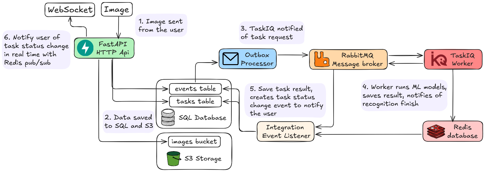

# Image recognition backend

Contents:

- [Problem solved](#problem-solved)
- [Architecture overview](#architecture-overview)
- [Running locally](#running-locally)
- [Deploying with Docker Compose](#deploying-with-docker-compose)

## Problem solved

This repo is a backend for dialectological text hand text recognition service. The intent is to speedup the process of digitization of existing archive of dialectological word cards at NaRFU.

The dialectological text is a text that conveys linguistic features using special symbols like acutes, apostrophes etc. Linguists at NaRFU go on dialectological expeditions to different villages, where examples of a dialect words and their usage are extracted from dialogs with the locals.

<div align="center">
  
  <p><i>Example of a dialectological word card to digitize</i></p>
</div>

## Architecture overview

Techonologies used:

- **FastAPI** for HTTP API and WebSockets
- **TaskIQ** for deffered image recognition on a separate worker
  - While working on the project, I developed [taskiq-cancellation](https://github.com/ACherryJam/taskiq-cancellation) for task cancellations
- **Ultralytics** for YOLO inference and Transformers, [Optimum.Onnx](https://github.com/huggingface/optimum-onnx) for TrOCR inference
- **PostgreSQL** database and **SQLAlchemy** ORM
- **Minio** S3 for image file storage
- **RabbitMQ** for TaskIQ broker and event exchange between app components
- **Redis** for TaskIQ result backend and event exchange using pub/sub

Application layers are structured in ways of Clean Architecture, dishka is used for dependency injection.

<div align="center">
  
  <p><i>Overview of data flow</i></p>
</div>

## Running locally

### Setup supporting infrastructure

1. Setup `.env.docker` file: rename `.env.docker.template` and fill out the variables

2. Create infra containers: PostgreSQL, RabbitMQ, Redis and Minio

```bash
docker compose -f compose-infra.yaml --env-file .env.docker up -d
```

### Setup application modules

1. Setup `.env.local` file: rename `.env.local.template` and fill out the variables

2. Create an virtual environment

```bash
uv venv

# Linux:
source .venv/bin/activate
# Windows:
.venv/Scripts/activate
```

3. Install dependencies

Modules for inference, such as pytorch, are put in the `cpu` and `gpu` extras. Depending on what device will be used for inference install either one of these.

```bash
uv sync --locked --extra cpu/gpu
```

4. Run migrations on the database

Alembic migrations are used to construct the database schema. The connection url is fetched from environment variables in `.env.local` that was configured earlier.

```bash
alembic upgrade head
```

5. Run application components

```bash
python -m src.presentation.http  # FastAPI-based HTTP API

python -m src.infrastructure.outbox  # Outbox processor sending integration events
python -m src.infrastructure.integration_event_listener  # Integration events handler
python -m src.infrastructure.recognition_worker  # Image recognition TaskIQ worker
```

## Deploying with Docker Compose

It's the same as running infra containers but with `compose.yaml` file instead. `compose.yaml` includes infra services and creates application services based on an image built with `Dockerfile`.

`Dockerfile` contains 3 build arguments:

- `PYTHON_VERSION` determines what `uv` docker image will be used. Defaults to "3.13".
- `INFERENCE_TYPE` determines what inference extra (cpu/gpu) will be installed. Defaults to "cpu".
- `TROCR_MODEL_TYPE` determines what type of TrOCR text recognition model to embed into resulting Docker image. Choices are "onnx" or "pytorch". Defaults to "pytorch".

Build arguments are configured in `x-image-builder` section of `compose.yaml`.

```yaml
x-image-builder: &image-builder
  build:
    context: .
    dockerfile: Dockerfile
    args:
      INFERENCE_TYPE: cpu
```

To run containers, run:

```bash
docker compose --env-file .env.docker -f compose.yaml up -d --build
```
